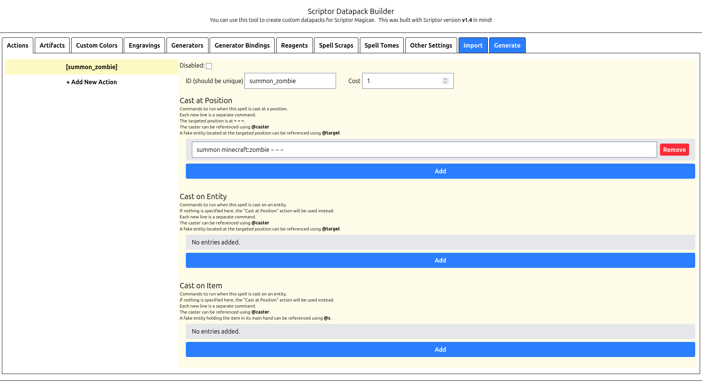
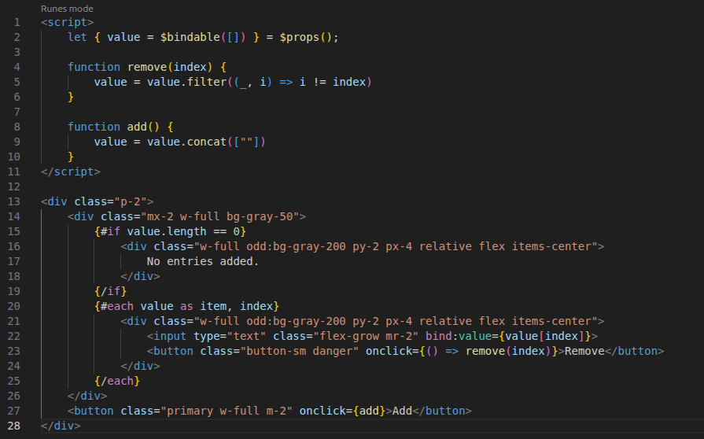

At least, probably.

Don't get me wrong, JavaScript is useful sometimes, it's a good technology
and can really punch up your website.

But you probably don't need it, especially not anything fancy like React.

## Why should I care?

I mean, I've made a lot of websites, and spent a lot of time optimizing 
load speed and improving user experience, but honestly?

The biggest reason might just be that you're making your website worse for no
reason.

## Why shouldn't I use it?

There are a lot of reasons you might not want to use JavaScript on your website.

Now, I could go on a diatribe about security, but honestly modern JavaScript is
pretty protected against that particular brand of footgunning, so unless you're
`eval`ing random code, you're *proooooobably* fine.
Just, like, think about things before you write them.

But there are other reasons JavaScript might not be for you.

First off, not every user will have JavaScript enabled, and even for users with
it enabled, they might not be on a super modern browser, or might be on a 
lower-end device which can't handle fancy JS rendering well.
Sure, you could use a polyfill, or you could design your site with older
JavaScript in mind, ooooor you could just not use it.

Also, JavaScript can break!
If you're using JS to render a website, and something does break, your user
is looking at, worst case, nothing or a completely broken website, and 
best case, a site that just isn't working for them.

Well, if you're not *using* JS, then your site will just load!
If something isn't right in HTML, you know what usually happens?
The part that you messed up looks wrong. Sometimes elements further down on the
page get caught in the crossfire, but that's usually pretty immediately 
apparent. 
It just works!

Plus, there's the unavoidable topic of load time.
A lot of JS libraries promise to optimize for first contentful render, and 
plenty offer tricks[^ssr] for improving that, but even if you use those,
defer all your `<script>` tags, and try to keep your initial layout simple,
you know what's faster?
Serving a static HTML file.

It's hard to come up with a general litmus test for when it's not needed, 
but for me it usually boils down to:

Could this have been an email?

Really! 

If your website doesn't need moving parts, or better, if it 
*really shouldn't have* moving parts, then that's great!

Business card websites?

Articles on a news site?

Catalogs?

Honestly, even a lot of forums and some social media probably don't even need
it, certainly not nearly as much of it as they have.

But if the page looks more or less the same every time you look at it?

Yeah, you don't need JavaScript.

## Why should I use it?

JS is good, I'm not going to tell you it's never useful.
If I did that, frankly, I'd be lying.

It's fantastic for adding small bits of polish to your website's user
experience. 

Changing your text field's border color as a bit of form validation can give
your users input a lot faster than if they had to submit the form first.

You *can* make drop-down menus with CSS only, but JavaScript makes those a lot
easier in many cases, and lets you do more with them.

And when something would only be hindered by forcing a user to call back to the
server, like widgets for telling the time, tickers for tracking numbers, or 
tools for converting numbers between bases, you probably don't want or need to
make the user reload the page constantly.

Lastly, though, there's one case where it's always good to use the tech 
you're looking at:

When it's fun!

If you think you'd have fun making something, do it!
[maia arson crimew's site](https://maia.crimew.gay/)
has a little kitten that follows the cursor.[^artist] [^code]
I love it!

If you're already used to something, and you think it'd be easier to make
your quick little toy using it?
Sure, go ahead!

If you want to play with a particular toy? 
Seriously, do it!

Personally, a lot of times I'll use a new library or framework just because
it's new to me and seems fun, and I'd be a hypocrite if I told you not to.
Really, you are the ultimate arbiter of whether it's worth it.

## What else is there?

There are a number of alternatives to using JavaScript, but my favorite is
probably the simplest:

Don't

For most websites, static HTML and some basic CSS is pretty good, actually!
You don't need any fancy technologies running the server, and you almost
definitely don't need clientside JS.
Business cards, link trees, honestly most personal websites don't need anything
fancy.

Sometimes, though, writing a webpage manually for each page isn't really practical.
What are your options here?
Well, it really depends on what you're doing:

### Static Site Generation

Hey, this site does that!

If you want to make a number of webpages based on a single template, especially
if you don't want to update every page when you update the template, static
site generators are a godsend.

There are a lot available, *and* it's pretty easy to roll your own!

Personally, I've hand-rolled some, mostly using JavaScript or Python.
This website is generated using a generator build in Node JS which uses Pug
as the template driver and a few miscellaneous libraries for data processing
and other bits and bobs.

This gives you a lot of freedom to implement exactly the features you want,
plus it's a fun way to stretch your proverbial legs if you haven't worked on
a website in a bit.

But if you're not super technically inclined, or just don't want to, there
are plenty of good options!

Honestly, 
[Myles Braithwaite's list of SSGs](https://github.com/myles/awesome-static-generators/blob/main/README.md)
seems pretty solid, and looks pretty comprehensive if you want to peruse.
It even includes a link to other lists of SSGs, pretty nice!

That being said, it's hard to beat the basics.
I've used [zs](https://git.mills.io/prologic/zs), and it does the job pretty well.
It has support for HTML with `{{mustache}}` template syntax for substitutions,
and lets you write your pages and such in Markdown, which is pretty handy.
(For Markdown editing, I use [KDE ghostwriter](https://ghostwriter.kde.org/),
which is simple and pretty effective. I wrote this article with it!)

When making documentation websites, a lot of times the language you're working
in comes with a solid generator.
Give that a go.
Oftentimes they're simple, straightforwards, and, importantly, don't require
any additional work on your part.
(Also for Lua check out 
[LDoc](https://github.com/lunarmodules/ldoc), 
it's pretty handy)

There might also be most purpose-built tools for whatever you're getting up to,
so feel free to shop around!
But what if you actually do need to show different information different times
the page is loaded?
Well, then you may need...

### Serverside Rendering

We used to understand this art, long ago, before so many decided to delegate
rendering mostly to the client.

CGI is ancient, and, frankly, beautiful. 
A simple design for rendering data fetched serverside, while getting to mostly
hold to the conventions of HTML.

PHP, ASP.NET, ColdFusion, and more drove most serverside rendering for a long
time, and PHP, Hack, and their ilk still have a pretty solid foothold on the
internet.

For websites where you don't need to do anything complex, like forums, blogs,
or even little things like view counters on old homepages, CGI is fantastic.
It means the programmer doesn't need to learn a whole new way to code, and
can often even adapt old pages or static pages elsewhere on the site.
Pretty neat!

But hey, CGI only *used* to be the status quo, what's the latest in SSR?

Well, what about CGI?

I kid, but for a lot of more complicated websites, technologies which are
technically CGI like Laravel can be quite handy.
These drivers are often pretty portable, thanks to their reliance on an
.htaccess file to route clients.
This means you can use them on a lot of "self hosting" sites with CGI support,
and still extract them to your own server at any point if you want.

But, if you're confident where you're going to be hosting something, you have
more options.

Webserver libraries like Express, Django, and their ilk are pretty handy to have
around, and can handle most things you would throw at em.

For a storefront or a blog where multiple users are frequently updating the
site's contents, pairing one of these technologies with an MVC lib can be make
managing everything either.
(not WordPress don't use WordPress I'm begging you)

And! Especially with caching, this sort of serverside rendering is pretty fast,
and incurs no additional cost on the client.
In a lot of cases, servers like this will let you have your cake and eat it too,
delivering dynamic content *and* providing a responsive, compatible interface
for your users.

In my experience, Django is very nice to work with, though not the fastest.
Flask is another good Python one, and Laravel, which I mentioned earlier, is
pretty solid and very portable.
Lastly, Express.js is a bit less batteries-included, but it's still pretty nice
and very fast.

Spring Boot is fine too, I guess.

Shop around, and see if you can find a good solution utilizing serverside
rendering before you decide to dip into

### Vanilla JS

Fiiiine, sometimes you really do need to do stuff clientside without waiting
for the page to reload. 
Or at least it'd be nice if you did.

Proactive form validation, theme toggle buttons, or cases where reloading a
page might be jarring to the user, like comments, voting on posts, etc.

Well, you probably still don't need anything fancy.

A lot of oldheads will tell you to use a library like jQuery, but, like.
Have you *actually* used just JavaScript lately?
There's a lot of useful stuff in there!

Plus, I know you love low load times, right?
Well, if you're not rendering the page after load, and you aren't loading
additional external libraries, that time to first contentful draw
will be *miniscule*.

Sure, you're probably familiar with `documen.getElementById`, but surely
for more complex queries you'll want `$`, right?

Nah, it's 2026, we have `document.querySelector`(/`All`), and it works pretty much the same. 
Want all `button`s with the `danger` class? 
`document.querySelectorAll("button.danger")`

What about links inside your `content` div?
`document.querySelectorAll("div.content > a[href]")`

But JS has plenty of handy tools for safely changing element text, constructing,
moving, and removing elements, and most things you'd want a library like jQuery
for anyways.
So why add the overhead? 
It's smaller *and* faster without a library dragging you down!

If you want to learn more about the miracle that is Vanilla JS, check out
[vanilla-js.com](http://vanilla-js.com/)!

### Getting Fancy

Okay, okay, but sometimes, JavaScript is good, but base JS doesn't offer
the tools you need (or just want).
Sure, you could get into libraries, maybe *now* you bring in jQuery, or just import lodash for its utilities?

But no, you're designing an application that's meant to be responsive, 
maintain local state, or render based on user input.
Lucky for you, there are technologies that are purpose-built for this!

This is when you ACTUALLY use those things I was saying you don't need
earlier!
React, Vue, or my favorite...

Svelte!

I like Svelte so much that I've been using it to build my
[Scriptor Datapack Builder](https://ssblur.github.io/scriptor-datapack-builder/)

I enjoy Svelte because the code looks straightforward, pages render fast, 
and has pretty great support for directly binding complex state back to 
the application, but it really is more or less interchangeable with those 
other techs.

Like, look how simple this string list element is!

That's it! 
It just looks like a little HTML element and corresponding script tag,
blending JS and SGML in a way very similar to e.g. JSX.

Fun fact about that complex binding though, the Scriptor Datapack Builder
pretty much stores the entire state in memory exactly as it looks in the 
actual datapack.
Makes it really convenient to export, and will hopefully make implementing
importing pretty easy, too.

Anyways, I got off topic.

These technologies really do come in handy, when you're rerendering an interface
often, or want an app to be responsive to a variety of kinds of user input.
There's a reason people made these libraries, after all.

Just, uh, please don't overuse them. 
These libraries are heavy, and while cross-platform application design is often
a selling point, a lot of times by using these instead of something simpler
you're precluding a lot of users with lower-end or incompatible devices.

## Why this doesn't matter

If you're making a site for a company, you almost certainly aren't deciding
what you make it with, and you definitely aren't deciding what it contains.

Pretty much every modern news site will have advertisements, a cookie popup,
a newsletter popup, or any of myriad other widgets and gadgets that do
necessitate JavaScript.
I'd argue these usually aren't necessary in the first place (you probably don't
need tracking cookies, random cooking website), but I don't often make those
decisions.

Website design is often by committee and corporate mandate, so technologies
which seem appealing to those in charge will often get picked over the ones
that actually suit use cases best.
The manager worked on a project that used Vue, so your wiki is built in Vue. 
This company already has an app written in React, so the same library is used
to build the basic portal you're working on right now.
You need to monetize your blog somehow, so you run advertisements.
It happens.

## Why this matters

I've made websites for work that *didn't* have a bunch of JS bloat in them!

And I've **certainly** made my own websites that didn't. 
You're on one!

Sometimes, you get to make the decisions. 
And when you're making those decisions, I only hope you might think back to this
and maybe consider whether you *really* need such a heavy JS frontend on your 
website.

## Anyways

Thank you for reading my screed. 
This is a topic I have a lot of opinions about, so there's a good chance
that I write more along these lines in the future, but this is hopefully
a pretty good summary of why I think it's usually not needed.

Plus, honestly, I've quite enjoyed making things without it!
It simplifies my site design, makes me think about what I actually need to do to
accomplish certain tasks, whether I need certain features, stuff like that.
Limitations breed creativity and all.

If you like this, maybe you'd enjoy me talking about something I like instead!
I wrote [an article about how much I love RSS](../Arr-Ess-Ess.html) a bit ago, I 
think that's a pretty fun one.

[^code]: maia's Kitten Cursor Code: https://github.com/adryd325/oneko.js
[^artist]: maia's Kitten Cursor Artist: https://twitter.com/_Anunnery
[^ssr]: React Server Components/SSR docs: https://react.dev/reference/rsc/server-components